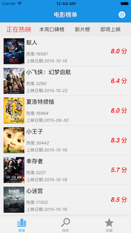
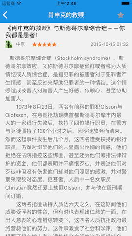

# MovieFans

###展示豆瓣电影数据
参考了豆瓣电影，学习了一些开源项目后的小成果

功能：

- 查看热门电影榜单、影评详情、影人、剧照、短评、影评
- 按标签和关键字检索电影
- 收藏影片、影人、影评 
- 夜间模式切换

源码说明：

- 源码去掉了友盟统计和豆瓣接口的AppKey。所以跑起来后，很多数据展现不出来是正常现象。
- App现已上架([电影迷](https://itunes.apple.com/cn/app/dian-ying-mi-kan-re-men-bang/id970057582?mt=8))，请不要再把应用打包发布。
- 本人技术水平有限，代码质量一般，甚至可能存在不少错误，要借鉴的话请加以辨别。
- 如果可以，非常渴望能得到高手指正代码的不足之处，不胜感激！

---
###主要页面效果图：

